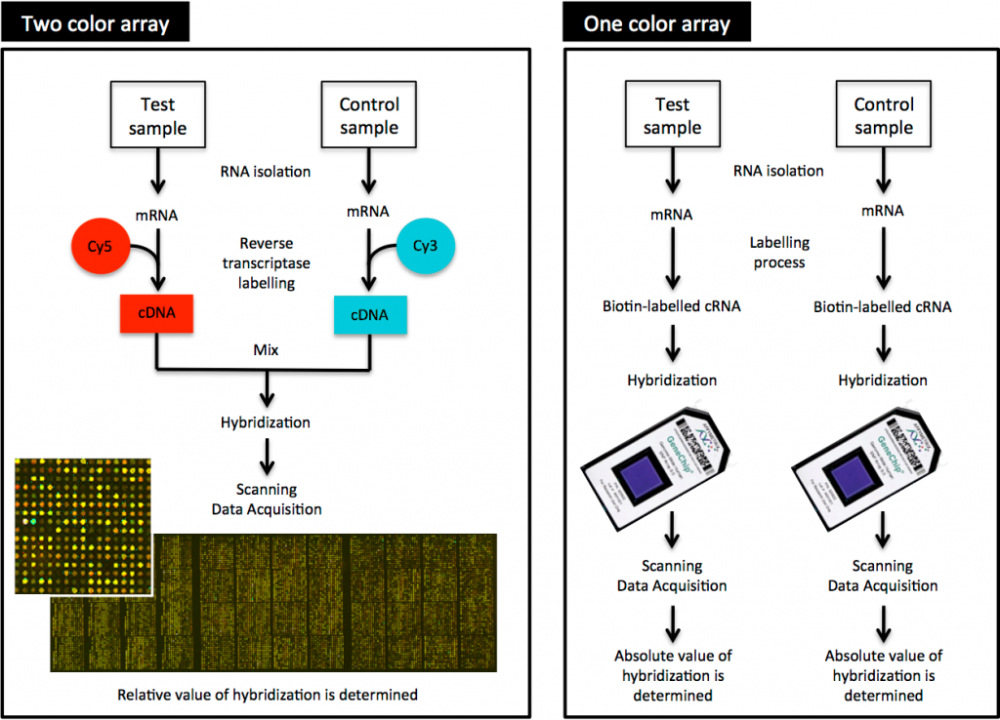
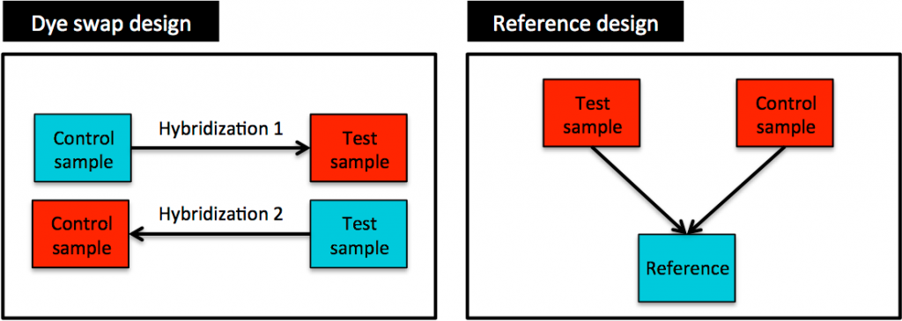
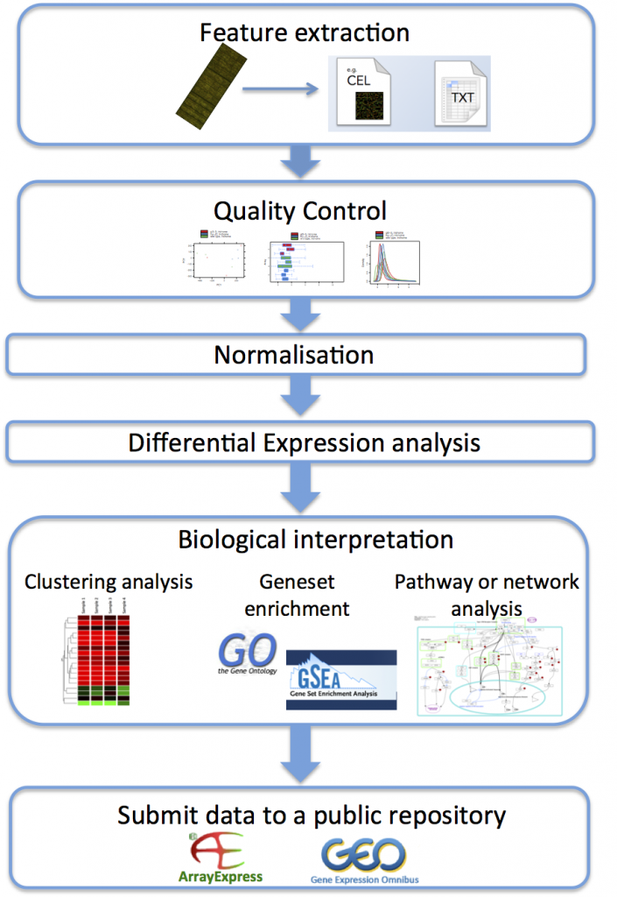
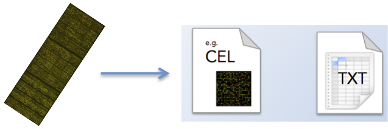
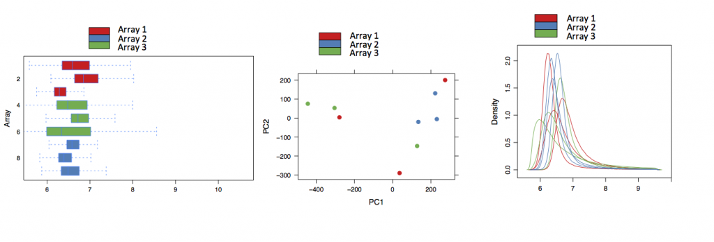

# GEO - Gene Expression Omnibus (GEO)

Data repository from NCBI with functional genomic data.

For Microarrays: ‘ink-jet printed’ onto slides (Agilent) or synthesised in situ (Affymetrix).

Two-colors: two biological samples (experimental/test sample and control/reference sample) are labelled with different fluorescent dyes, usually Cyanine 3 (Cy3) and Cyanine 5 (Cy5). Equal amounts of labelled cDNA are then simultaneously hybridised to the same microarray chip. After this competitive hybridisation, the fluorescence measurements are made separately for each dye and represent the abundance of each gene in one sample (test sample, Cy5) relative to the other one (control sample, Cy3).

Limitations: Previous genome knowledge, cross-hybridisation, limited dynamic range of detection owing to both background and saturation signals, complicated normalisation methods. (dye bias effect).



Design: dye swap design or a reference design (Reference design is the most common).

**Also necessary to include Technical** replicates and **biological** replicates



Usual pipeline:



## A. Feature extraction



|                   |                                      |                    |
|:------------------|:---------------------------------|:-------------------|
| Affymetrix        | .CEL                                 | affy, limma, oligo |
| Agilent           | feature extraction file (txt or tsv) | limma              |
| GenePix (scanner) | .gpr (tsv)                           |                    |
| Illumina          | .idat (binary)                       | illuminaio         |
| txt (tsv)         | lumi                                 |                    |
| Nimblegen         | NimbleScan, .pair (tsv)              |                    |

## B Quality Control



## C Normalisation

For Expression Atlas, Affymetrix microarray data is normalised using the ‘Robust Multi-Array Average’ (RMA) method within the ‘oligo’ R package.

Agilent microarray data is normalised using the ‘limma’ package: ‘quantile normalisation’ for one-colour microarray data.

## D Differential expression analysis

The ‘limma’ package that is used to identify differentially expressed genes incorporates a method to correct for multiple testing. This method creates a log2 fold change ratio between the test and control condition and an ‘adjusted’ p-value that rates the significance of the difference.

## 1. Definitions

-   Platform: an array or sequencer.
-   Sample: sample source, protocols used, and expression data.
-   Series: related samples.
-   DataSet: curated collection of biologically and statistically comparable GEO Samples.
-   Profile: expression measurements for an individual gene across all Samples in a DataSet.

## 2. Datasets structure

-   assayData: raw or processed intensities (samples in columns).
-   phenoData: metadata (samples in rows).
-   featureData: annotation.
-   annotation: platform name.

![\[1\]: Figure from Greg Tucker-Kellogg](images/ExpressionSet.png)

## 3. GEO Files (CEL \>\> SOFT \>\> Matrix)

-   SOFT: information about the experiment (MIAME), estimates for each gene, transcript.
-   MINiML: XML format.
-   Series matrix file: directly to a spreadsheet.
-   `.CEL` (Supplemental files): Original, unprocessed data.
-   GSE object: sample(GSM, GSMList) + platform(GPL, GPLList)
-   `GDS2eSet` ExpressionSet with processed data.

![\[2\]: GSE55851](images/paste-1.png)

#### Additional information:

-   GEO Data Set(GDS): processed data on GEO (it may have multiple platforms). \[GDS2eSet, GDSXXXX\]

-   ExpressionSet: only one platform, if \[GSEMatrix=TRUE\]

-   GSE: \[GSEMatrix=FALSE\]

## 4. Normalisation

### Affymetrix

RMA normalized and filtered to remove low-expressing genes.

RMA: Robust Multiarray Average (Affymetrix arrays), this includes log2 at the last step. (If it is log-transformed: typically in the range of 0 to 16)

AffyBatch -\> ExpressionSet

-   Background correction: removal of background noise (probe pairs, a perfect match (PM), and single base mismatch (MM): Affymetrix’s own MAS5 algorithm):
    -   RMA ALGORITHM ignores MM probes.
    -   gcrma algorithm: background depends on the GC content.
-   Normalisation: quantile normalisation, data on a common empirical distribution
    -   \`normalize(set, method='quantile', which='pm')\`
    -   \`hist(oligo_set, lwd=2, xlab='log intensity', which='pm')\`
-   Summarisation
    -   \`rma(oligo_norm, background=FALSE, normalize=FALSE)\`
    -   \`histo(oligo_sum)\`

### RMA in R

\`affy::rma()\` - takes an AffyBatch object, returns an ExpressionSet

\`oligo::basicRMA()\` - takes an ExpressionFeatureSet object

### Exploring ExpressionSet

`pData(GSE55851)[1:5,]# Data information or Phenotype data`

`fData(GSE55851)` \# Gene annotation

`exprs(GSE55851)[1,]`\` \# Expression data

`varLabels(GSE55851)`\` \# Metadata

\`GSE55851\$supplementary_file\`#Raw files

`annotation(GSE55851)`\`# Chip information

`experimentData(GSE55851)`\`#Experimental info

`featureData(GSE55851)`\`#Probeset data

### Affymetrix

<https://pmc.ncbi.nlm.nih.gov/articles/PMC3902802/>

Set of probes of 20bp for one gene

CEL > SOFT > Matrix

## Tutorials

https://gtk-teaching.github.io/Microarrays-R/ https://github.com/wkzawadzka/bioanalysis/blob/master/microarrays/workflows/agilent/workflow.R https://github.com/NelleV/2019timecourse-rnaseq-pipeline/blob/e345b60679c6f24e02b54b63ab59c46e75d65481/scripts/miscellaneous/normalization.Rmd#L17

### 1. Loading packages

```{r}
options(timeout = max(300, getOption("timeout")))
options(download.file.method.GEOquery = "curl")
options

if (!requireNamespace("BiocManager", quietly = TRUE))
    install.packages("BiocManager")

BiocManager::install("GEOquery")
BiocManager::install("limma")
pacman::p_load(GEOquery, tidyverse, ggrepel, survminer, limma, oligo, DT, marray)
pacman::p_load(pheatmap, tidyplots)
pacman::p_load(data.table, biomaRt, arrayQualityMetrics, testit, gplots, AgiMicroRna)
pacman::p_load(
    affy,
    oligo,
    oligoClasses,
    limma,
    hgu133plus2.db,
    org.Hs.eg.db
)
library(reshape2)
# tips: browseVignettes('packagename')
# tips: methods(class=class(foo))
# for vscode: pip3 install -U radian


```

### 2. Scenario A: Assuming everything is fine (data normalized)

The affy package also has a list.celfiles() function (with a slightly different interface), and offers a read.AffyBatch() function to read celfiles. However, the affy package can only work with 3′ biased Affymetrix arrays, so oligo is preferred

For Agilent files, important columns are typically: - gMedianSignal (foreground) - gBGMedianSignal (background) - gIsWellAboveBG (quality flag)

ExpressionFeatureSet - Array GeneFeatureSet

The function, rma() from the affy package takes in an AffyBatch object. The function basicRMA() from the oligo package takes in an ExpressionFeatureSet object.

```{r}
options(GEOquery.integrate.https = FALSE)
softgse = getGEO("GSE55851", GSEMatrix=FALSE, destdir=".temp" ) #GSEMatrix will download a soft vs matrix (GSE vs ExpressionSet)
softgse
methods(class=class(softgse))
# head(Table(softgse)) #works for soft
head(Meta(softgse)) #works for soft
Meta(softgse)
methods(class=class(softgse))
class(softgse) # GSE because is a SOFT file: GSM + GPLlist
names(GSMList(softgse))
GPLList(softgse)

### Downloading CEL files
filePaths <- getGEOSuppFiles('GSE55851', baseDir=".temp")
untar(rownames(filePaths)[1], exdir = ".temp/GSE55851")

sample_file <- list.files(".temp/GSE55851", pattern = "\\.txt\\.gz$", full.names = TRUE)[1]
head(read.delim(gzfile(sample_file), nrows = 3))

# This dataset is from agilent
agilent_data <- read.maimages(
  files = list.files(".temp/GSE55851", pattern = "\\.txt\\.gz$", full.names = TRUE),
  source = "agilent",
  green.only = TRUE,
  columns = list(
    G = "gMedianSignal",       # Foreground signal
    Gb = "gBGMedianSignal"     # Background signal
  ),
  other.columns = "gIsWellAboveBG"  # Quality flag (if column exists)
)


# After successful read
# Correct background (recommended: "normexp" for Agilent)
bg_corrected <- limma::backgroundCorrect(agilent_data, method = "normexp") #offset = 50)
# Quantile normalization (standard for single-color)
normalized_data <- normalizeBetweenArrays(bg_corrected, method = "quantile")


## check it
plotDensities(normalized_data, legend = FALSE)
### method 2, if it contains p-values
agilent_data <- read.maimages(files = list.files(".temp/GSE55851", pattern = "\\.txt\\.gz$", full.names = TRUE), source = "agilent", green.only = TRUE)
agilent_data


normalized_data <- limma::neqc(agilent_data)
# Optional: Log2 transform (if not done automatically)
# normalized_data$E <- log2(normalized_data$E)
# exploratory analysis -----------------------------------------

pca <- prcomp(t(normalized_data$E))
plot(pca$x[, 1:2], pch = 19, col = "blue", main = "PCA Plot")

# Remove probes with low signal (if quality flags exist)
if ("gIsWellAboveBG" %in% names(normalized_data$other)) {
  keep <- rowSums(normalized_data$other$gIsWellAboveBG == 1) >= ncol(normalized_data)/2
  normalized_data <- normalized_data[keep, ]
}

# Remove control probes (e.g., Agilent's "A_" prefixes)
is_control <- grepl("^A_", rownames(normalized_data))
normalized_data <- normalized_data[!is_control, ]


############## Annotation
gpl_annot <- read.delim(gzfile(".temp/GSE55851/GPL/GPL10332_old_annotations.txt.gz"), skip=21)
colnames(gpl_annot)
head(gpl_annot$CYTOBAND, 100)
gpl_annot |>
  filter(str_detect(CHROMOSOMAL_LOCATION, "chrX"), str_detect(CYTOBAND, "Xq24")) |>
  dplyr::select(1:2,8:10, 16) |>
  separate(CHROMOSOMAL_LOCATION, into = c("CHROMOSOME", "LOCATION"),  # New column names
  sep = ":"
) |>
  separate(
  LOCATION,
  into = c("START", "END"),  # New column names
  sep = "-"
) |>
 filter(as.numeric(START)> 107907753, as.numeric(END)<127990931)
 
zinc_finger_probes <- gpl_annot[gpl_annot$CHROMOSOME == "20" & 
                                gpl_annot$START >= 61678917 & 
                                gpl_annot$END <= 61682078, ]
zinc_finger_probes <- gpl_annot[grep("HBZ", 
                                    gpl_annot$GENE_SYMBOL, 
                                    ignore.case = TRUE), ]
zinc_finger_probes

```

```{r}
library(Biobase)
#____________________________________________________________

############ #Another method
ensembl <- useMart('ensembl', dataset = 'hsapiens_gene_ensembl')

library(biomaRt)
ensembl <- useMart('ensembl', dataset = 'hsapiens_gene_ensembl')
tables <- listAttributes(ensembl)
tables[grep('agilent', tables[,1]),] # look for our version
# # Platform: GPL1708	Agilent-012391 Whole Human Genome Oligo Microarray G4112A (Feature Number version)
# annot <- getBM(
#   attributes = c('agilent_gpl6848',
#                  'wikigene_description',
#                  'ensembl_gene_id',
#                  'entrezgene_id',
#                  'gene_biotype',
#                  'external_gene_name'),
#   filters = 'agilent_gpl6848',
#   values = probes,
#   mart = ensembl)
# annot <- merge(
#   x = as.data.frame(probes),
#   y =  annot,
#   by.y = 'agilent_gpl6848',
#   all.x = T,
#   by.x = 'probes')
# 
# annotEntrez <- annot[!is.na(annot$entrezgene_id),]
# annotEntrez <- annotEntrez[which(annotEntrez$probes %in% RG$genes$ProbeName),]
# annotEntrez <- annotEntrez[match(RG$genes$ProbeName, annotEntrez$probes),]
# table(RG$genes$ProbeName == annotEntrez$probes) # check allignment
# 
# write.table(
#   annotEntrez,
#   paste0(accesion_number, '/Annotations_', gsub("-", "_", as.character(Sys.Date())), '.tsv'),
#   sep = '\t',
#   row.names = FALSE,
#   quote = FALSE)
# 
# RG$genes$Entrez <- annotEntrez$entrezgene_id
# #RG$genes$Ensembl <- annotations$ENSEMBL_ID
# RG$genes$GeneName <- annotEntrez$external_gene_name

gene_freq = as.data.frame(table(agilent_data$genes$GENE_SYMBOL, useNA="ifany"))
gene_freq
gene_freq = gene_freq[order(-gene_freq$Freq),]
gene_freq[1:20,]

# Check genes composition
ggplot(gene_freq[1:50,], aes(x = Freq, y = reorder(Var1, Freq))) +
  geom_bar(stat = "identity", fill = "skyblue") +
  geom_text(aes(label = Freq), hjust = -0.1, size = 3) +
  labs(x = "Frequency", y = "Probe/Gene name") +
  theme_minimal() # most control 

# genes with multiple "copies" across the genome 

         

```

```{r}
library(biomaRt)
library(GenomicRanges)

# Connect to Ensembl
ensembl <- useMart("ensembl", dataset = "hsapiens_gene_ensembl")

# Get coordinates of your gene (e.g., "BRCA1")
gene_info <- getBM(
  attributes = c("chromosome_name", "start_position", "end_position"),
  filters = "hgnc_symbol",
  values = "ZCCHC12",  # Replace with your gene of interest
  mart = ensembl
)
gene_info
# Define the target region (±100kb)
target_region <- GRanges(
  seqnames = gene_info$chromosome_name,
  ranges = IRanges(
    start = gene_info$start_position - 100000,
    end = gene_info$end_position + 100000
  )
)

nearby_genes <- getBM(
  attributes = c("hgnc_symbol", "chromosome_name", "start_position", "end_position"),
  filters = c("chromosome_name", "start", "end"),
  values = list(
    chromosome_name = gene_info$chromosome_name,
    start = start(target_region),
    end = end(target_region)
  ),
  mart = ensembl
)
nearby_genes
# Filter out the target gene itself
nearby_genes <- nearby_genes[nearby_genes$hgnc_symbol != "BRCA1", ]
```

```{r}
rm(list=ls())

# GEO ID and folder
htlv_id = "GSE55851"
htlv_tempdir=".temp/"

# 1. obtaining processed data
gse2 = getGEO(
  htlv_id, 
  GSEMatrix=TRUE, 
  destdir=htlv_tempdir) # this will download a file: GSE55851_series_matrix.txt.gz

# 2. exploring: number of platforms
length(gse2)
class(gse2)


# 3. subsetting
gse2 <- gse2[[1]] # OBJECT: ExpressionSet

# 4. further exploration

pData(gse2) # Sampledata
colnames(pData(gse2))
head(pData(gse2)$supplementary_file)
datatable(pData(gse2)) #select important variables
pData(gse2)$data_processing[1]

fData(gse2) # gene annotation
exprs(gse2) # expression data

gse2@annotation # which chip

# 5. metadata - extract relevant data

pinfo = pData(gse2) |>
  dplyr::rename(
      type_disease="characteristics_ch1.1",
      age="characteristics_ch1.2", 
      gender="characteristics_ch1.3"
  ) |>
  dplyr::select(
      type_disease, 
      age, 
      gender) |>
  dplyr::mutate(
      across(
          everything(), ~ sub(".*: ", "", .)
      )
  )
pinfo$group = NA

for (i in 1:nrow(pinfo)) {
    if (str_detect(pinfo$type_disease[i], regex("ATL", ignore_case = TRUE)) && (pinfo$gender[i]=="male")) {pinfo$group[i] <- "ATL-male"} 
    else if (str_detect(pinfo$type_disease[i], regex("carrier", ignore_case = TRUE)) && (pinfo$gender[i]=="male")) {pinfo$group[i] <- "AC-male"} 
    else if (str_detect(pinfo$type_disease[i], regex("Normal", ignore_case = TRUE)) && (pinfo$gender[i]=="male")) {pinfo$group[i] <- "HD-male"}
}

pinfo$ID <- rownames(pinfo)
datatable(pinfo)

# 6. QC: Check if normalised
summary(exprs(gse2))
boxplot(exprs(gse2), col = "lightblue", main = "Expression Distribution", las = 2, outline=F)

summary(log2(exprs(gse2)))
boxplot(log2(exprs(gse2)), col = "lightblue", main = "Expression Distribution", las = 2, outline=F)

isLog2Transformed(exprs(gse2))
 
# 6.1 Basic plotting
plotDensities(exprs(gse2), legend = FALSE, main = "Density Plot of Expression Values")
plotDensities(log2(exprs(gse2)), legend = FALSE, main = "Density Plot of Expression Values")

oligo::hist(log2(exprs(gse2)))

limma::plotMA(exprs(gse2), main = "MA Plot")
limma::plotMA(log2(exprs(gse2)), main = "MA Plot")

# Sum of NAs
sum(is.na(exprs(gse2)))

# 6.2 Customized plotting 
exprs_data <- melt(as.data.frame(log2(exprs(gse2))))

# customized with ggplot2
ggplot(exprs_data, aes(x = variable, y = value)) +
  geom_boxplot(fill = "lightblue") +
  theme(
      axis.text.x = element_text(angle = 90, hjust = 1)
  ) +
  labs(
      title = "Expression Distribution", 
      x = "Samples", 
      y = "Expression Value")

# customized with tidyplots
exprs_data |>
    tidyplot(x=variable, y=value) |>
    add_boxplot() |>
    adjust_x_axis(rotate_labels = 60) |>
    adjust_size(width = 100, height = 100)

# 6.3 customized plotting B
ggplot(exprs_data_melt, aes(x = value, color = variable)) +
  geom_density() +
  labs(title = "Density Plot of Expression Values", x = "Expression Value", y = "Density")

# 6.4 Unsupervised clustering (understand the sources of variation and outliers - hierarchical clustering) correlation on the scale of 0 to 1
rownames(pinfo) <- colnames(cor(exprs(gse2), use="c"))
pheatmap(cor(exprs(gse2), use="c"))
pheatmap(cor(exprs(gse2), use="c"), annotation_col=pinfo[,c(3,5)]) #c stops if any missing data point, "complete.obs"

# PCA - mandatory to transpose
pca <- prcomp(t(exprs(gse2)), scale.=TRUE)

cbind(pinfo, pca$x) |>
tidyplot(x=PC1, y=PC2, col=type_disease, label=age, shape=gender) |>
add_data_points(rasterize = FALSE, rasterize_dpi = 300) |>
add_data_labels_repel() |>
adjust_size(width = 100, height = 100, unit = "mm")

#remove outliers: gse <- gse[,-outlier_samples]
#####################

# 7---- Normalisation
# Load required libraries
library(limma) #“Linear models for microarray”

# 7.2 Background correction
gsm2 <- limma::backgroundCorrect(gse2,  method="normexp", offset = 20)

# Step 3: Normalize the data
#gsm2_ma <- limma::normalizeWithinArrays(gsm2, method="loess") # only for two-color arrays
agilent_data_norm <- limma::normalizeBetweenArrays(gsm2, method = "quantile")
agile2log = log2(agilent_data_norm)

# Step 4. Check normalization
summary(agile2log)
boxplot(agile2log, col = "lightblue", main = "Expression Distribution", las = 2, outline=F)
plotDensities(agile2log, legend = FALSE, main = "Density Plot of Expression Values")
oligo::hist(agile2log)
limma::plotMA(agile2log, main = "MA Plot")

pca <- prcomp(t(agile2log))
cbind(pinfo, pca$x) |>
tidyplot(x=PC1, y=PC2, col=type_disease, label=age, shape=gender) |>
add_data_points(rasterize = FALSE, rasterize_dpi = 300) |>
add_data_labels_repel() |>
adjust_size(width = 100, height = 100, unit = "mm")

library(pheatmap)
pheatmap(cor(agilent_data_norm, use="c"), annotation_col=pinfo[,c(3,1)])


# ------8. Differential expression analysis

design <- model.matrix(~0 + pinfo$group)
## calculate median expression level
cutoff <- median(agile2log)

## TRUE or FALSE for whether each gene is "expressed" in each sample
is_expressed <- agile2log > cutoff
## Identify genes expressed in more than 2 samples
keep <- rowSums(is_expressed) > 3
## check how many genes are removed / retained.
table(keep)
## subset to just those expressed genes
agile2log_exp <- agile2log[keep,]
design
# coping with outliers ##### CAREFUL
## calculate relative array weights
aw <- arrayWeights(agile2log_exp[,c(1:2, 4:12, 20)], design)
aw
colnames(design) = c("ACmale",  "ATLmale", "HDmale" )
## Fitting the coefficients
fit <- lmFit(agile2log_exp[,c(1,2, 4,5,6,7,8,9,10,11,12, 20)], design, weights = aw)


## Making comparisons between samples, can define multiple contrasts
contrasts <- makeContrasts(ACmale - ATLmale, ACmale - HDmale , levels = design)

fit2 <- contrasts.fit(fit, contrasts)
fit2 <- eBayes(fit2)


topTable(fit2)
topTable1 <- topTable(fit2, coef=1)
topTable2 <- topTable(fit2, coef=2)
topTable3 <- topTable(fit2, coef=3)
topTable4 <- topTable(fit2, coef=4)

#if we want to know how many genes are differentially expressed overall, we can use the decideTest function.

summary(decideTests(fit2))
table(decideTests(fit2))

anno <- fData(gse2)
colnames(anno)
head(anno)
anno <- dplyr::select(anno, NAME, ID,GB_ACC, GENE_SYMBOL, GENE_NAME)


datatable(anno)

topTable(fit2)

# traspose?


## Create volcano plot
full_results1 <- topTable(fit2, coef=2, number=Inf)
tibble::rownames_to_column(full_results1,"IDx")
full_results
  
ggplot(full_results1,aes(x = logFC, y=B)) + geom_point()

## change according to your needs
p_cutoff <- 0.05
fc_cutoff <- 1

top_genes <- full_results1 %>%
  arrange(desc(abs(logFC))) %>%
  dplyr::slice(1:10)
top_genes

full_results1 %>% 
  mutate(Significant = P.Value < p_cutoff, abs(logFC) > fc_cutoff ) %>% 
  ggplot(aes(x = logFC, y = B, col=Significant)) + geom_point() +
geom_point(data = top_genes, aes(x = logFC, y = B), color = "red", size = 2) +  # Highlight top 10 genes
  geom_text_repel(
    data = top_genes,  # Annotate top 10 genes
    aes(label = GENE_SYMBOL),
    box.padding = 0.5,  # Adjust spacing
    point.padding = 0.2,  # Adjust spacing
    max.overlaps = Inf,  # Ensure all labels are shown
    size = 3,  # Label text size
    color = "black"  # Label text color
  )

dplyr::filter(full_results1, grepl("TP53", GENE_SYMBOL))

ids_of_interest <- mutate(full_results1, Rank = 1:n()) %>% 
  filter(Rank < topN) %>% 
  pull(ID)
gene_names <- mutate(full_results1, Rank = 1:n()) %>% 
  filter(Rank < topN) %>% 
  pull(GENE_SYMBOL) 

  
gene_matrix <- agile2log[ids_of_interest,]

pheatmap(gene_matrix, labels_row = gene_names, scale="row")

my_genes <- c("HIG2", "CA1","ETV4","FOXA1")
ids_of_interest <-  filter(full_results,Symbol %in% my_genes) %>% 
  pull(ID)

gene_names <-  filter(full_results,Symbol %in% my_genes) %>% 
  pull(Symbol)

gene_matrix <- exprs(gse)[ids_of_interest,]
pheatmap(gene_matrix,
         labels_row = gene_names,
         scale="row")

 
library(ggrepel)
p_cutoff <- 0.05
fc_cutoff <- 1
topN <- 20

full_results1 %>% 
  mutate(Significant = adj.P.Val < p_cutoff, abs(logFC) > fc_cutoff ) %>% 
  mutate(Rank = 1:n(), Label = ifelse(Rank < topN, Symbol,"")) %>% 
  ggplot(aes(x = logFC, y = B, col=Significant,label=Label)) + geom_point() + geom_text_repel(col="black")
## Get the results for particular gene of interest
#GB_ACC for Nkx3-1 is NM_001256339 or NM_006167
##no NM_001256339 in this data
full_results2 <- topTable(fit2, coef=2, number=Inf)
full_results3 <- topTable(fit2, coef=3, number=Inf)
full_results4 <- topTable(fit2, coef=4, number=Inf)
filter(full_results1, GB_ACC == "NM_006167")
filter(full_results2, GB_ACC == "NM_006167")
filter(full_results3, GB_ACC == "NM_006167")
filter(full_results4, GB_ACC == "NM_006167")


rownames(design)
GSE46518_set <- rma(GSE46518_celdata)
hist(GSE46518_set, target="core")

# Step 3: Within-array normalization (Loess)
agilent_data_norm <- normalizeWithinArrays(agilent_data_bg, method = "loess")

# Step 4: Between-array normalization (Quantile)
agilent_data_norm <- normalizeBetweenArrays(agilent_data_norm, method = "quantile")

# Step 5: Log2 transformation
agilent_data_log <- log2(agilent_data_norm$M)

# Step 6: Save normalized data
write.table(agilent_data_log, file = "normalized_data.txt", sep = "\t", quote = FALSE)
```

```{r}
# Option A: Retrieving GSE objects

htlv_id = "GSE55851"
htlv_tempdir=".temp/"
gse = getGEO(
  htlv_id, 
  GSEMatrix=FALSE, #parse SOFT (more information, less errors, slower)
  destdir=htlv_tempdir)

methods(class=class(gse))
Meta(gse)
#methods
length(gse)
class(gse)
methods(class=class(gse) #GPLList + GSMList + Metadata
names(GSMList(gse))
names(GPLList(gse))

# Option B: Retrieving ExpressionSet objects (Geo dataset)
gse2 = getGEO(
  htlv_id, 
  GSEMatrix=TRUE, 
  destdir=htlv_tempdir)

gse2[[1]]$data_processing
gse2[[1]]$platform_id

# Exploring
class(gse2)
methods(class=class(gse2))
length(gse2)

# Subsetting to 1
GSE55851<-gse2[[1]]

# Exploring
class(GSE55851)
methods(class=class(GSE55851))
length(GSE55851)
varLabels(GSE55851)
GSE55851$supplementary_file

pd <- pData(GSE55851)
pd["cel_file"] <- str_split(GSE55851$supplementary_file, "/") |> map_chr(tail,1)
pd["cel_file"]

# Option C: raw files mostly for affymetryx, ExpressionFeatureSet or genefeatureset
accession_number = 'GSE46518' #"GSE46518", "GSE55851"

## --- C.1A download through getGEOSuppFiles (sometimes doesnt work)
# oligo::read.celfiles() for Affymetrix, 
# OligoClasses: list.celfiles()
# gse33146_celdata <- read.celfiles(list.celfiles('GSE33146',full.names=TRUE,listGzipped=TRUE))
# oligoClasseslist.celfiles()
#image(gse33146_celdata[,1])

# read.AffyBatch() only works with 3' Affymetrix chips
GEOquery::getGEOSuppFiles(accession_number, makeDirectory = TRUE, baseDir = "./.temp")
tar_file = paste0(accession_number, "/", accession_number, "_RAW.tar")
untar(tar_file, exdir=paste0(accession_number, "/raw"))

## --- C.1B download checking first GEO metadata
gse_data = GEOquery::getGEO(
  accession_number, 
  GSEMatrix=TRUE,
  destdir="./.temp")

gse_data[[1]]$supplementary_file


library(oligo)
library(oligoClasses)

# Check the platform (GPL) number
Meta(gse)$platform_id

# Agilent: single vs double channel (green and red)
library(limma)
# Step 1: Load Agilent data
files <- list.files("path/to/Agilent/files", pattern = "*.txt", full.names = TRUE)
agilent_data <- read.maimages(files, source = "agilent", green.only = TRUE)

#or

files <- list.files("GSE55851/GSE55851_RAW/", pattern = "^GSM.*.txt.gz", full.names = TRUE)
files
# Read the Agilent files
agilent_data <- read.maimages(files, source="agilent", columns=list(G = "gMedianSignal"), green.only=TRUE)
agilent_data
agilent_data$targets

#If affymetrix
gse55851_celdata <- read.celfiles(paste0('GSE55851/GSE55851_RAW/',pd$cel_file),phenoData=phenoData(gse2))
pData(gse55851_celdata)[,c("geo_accession", "cell type:ch1", "treatment_ch1")]
varLabels(gse2)

```

```{r}
pacman::p_load(tidyverse)
# Ultimate example
htlv_id = "GSE46518"
# Obtain the processed data
gse_GSE46518 = getGEO(
  htlv_id, 
  GSEMatrix=TRUE)

GSE46518 = gse_GSE46518[1]
methods(class=class(gse_GSE46518))
methods(class=class(GSE46518))
GSE46518[[1]]$supplementary_file

pData(GSE46518[[1]])

#Obtain data and attach to supp files
pd <- pData(gse_GSE46518[[1]])
pd["cel_file"] <- str_split(gse_GSE46518[[1]]$supplementary_file, "/") |> map_chr(tail,1)
pd["cel_file"]

#Download raw data
getGEOSuppFiles('GSE46518',makeDirectory = TRUE, baseDir = ".temp/")
# Another download option
gse46518 = "https://www.ncbi.nlm.nih.gov/geo/download/?acc=GSE46518&format=file"

pacman::p_load(curl)
curl_download(gse46518, destfile = "./.temp/GSE46518_RAW.tar")

# Untar
untar(".temp/GSE46518_RAW.tar", exdir = "./GSE46518")

# Read CEL files
library(Biobase)  # Required for AnnotatedDataFrame
# Convert the data.frame to an AnnotatedDataFrame
gsepd<- AnnotatedDataFrame(pData(gse_GSE46518[[1]]))
GSE46518_celdata <- read.celfiles(paste0('GSE46518/',pd$cel_file),phenoData=gsepd)

varLabels(GSE46518_celdata)
pData(GSE46518_celdata)[,c("geo_accession", "infection:ch1")]

hist(GSE46518_celdata, target="core")

## RMA
GSE46518_set <- rma(GSE46518_celdata)
hist(GSE46518_set, target="core")

## gcrma, when concern about GC content, affymetryx and low levels
pacman::p_load(gcrma)
GSE46518_gcrma <- gcrma(GSE46518_celdata)
```

```{r}
# Exploring ExpressionSet
pData(GSE55851)[1:5,] # Data information or Phenotype data
fData(GSE55851) # Gene annotation
exprs(GSE55851)[1,] # Expression data
varLabels(GSE55851) # Metadata
GSE55851$supplementary_file #Raw files
annotation(GSE55851) # Chip information
experimentData(GSE55851) #Experimental info
featureData(GSE55851) #Probeset data
#To check if raw data matchs with metadata
pdcheck <-pData(GSE55851)
pdcheck['supp_name'] <- str_split(pdcheck$supplementary_file,"/") |>
  map_chr(tail,1)
pdcheck['supp_name'] 
```

```{r}
pData(GSE46518_celdata)$data_processing[1] 
summary(exprs(GSE46518_celdata)) # rarely more than 16
# exprs(gse) <- log2(exprs(gse))
boxplot(exprs(gse),outline=F)
```

## 4. Linear models

Generate a model to specify the design and fit the model to the design.

`y ~ x + 0`: The "0" will remove the intercept.

```{r}
library(limma)

design_htlv <- model.matrix( ~ GSE46518_celdata[["infection:ch1"]])
colnames(design_htlv)[2] <- "model_htlv"

# To check our model
design_htlv

# Fit a linear model 
fit_htlv <-lmFit(GSE46518_set, design_htlv)

# Empirical Bayes correction in limma: distribution across genes to calculate a robust test statistic
fitted.ebayes <- eBayes(fit_htlv)

# Extracting DE genes
topTable(fitted.ebayes)

# Decide test - which features pass the test criteria (Benjamini-Hochberg p=0.05, no log fold change cutoff)

summary(decideTests(fitted.ebayes[, "model_htlv"], lcf=1))

GSE46518_ex_values <- exprs(GSE46518_celdata)
fData(GSE46518_celdata)
# Define probe set IDs for sex-specific genes
sex_genes <- c("220729_s_at", "205000_at", "205038_at", "205040_at")
sex_gene_expression <- GSE46518_ex_values[sex_genes, ]
head(GSE46518_ex_values)

annotation(GSE46518_celdata)
featureNames(GSE46518_celdata)
gse_GSE46518
gpl <- getGEO("GPL5175")
anno_table <- Table(gpl)
head(anno_table)

```

c("XIST: 220729_s_at (Affymetrix Human Genome U133 Plus 2.0 Array) RPS4Y1: 205000_at KDM5D: 205038_at DDX3Y: 205040_at

```{r}
#vector of sex genes
sex = c("XIST", "RPS4Y1", "KDM5D", "DDX3Y")

## table
str(anno_table)
selected_rows <- anno_table[grep("DDX3Y|KDM5D|RPS4Y1|XIST", anno_table$mrna_assignment, ignore.case = TRUE), ]

sex_id = selected_rows$ID

sex_id

###
head(GSE46518_ex_values)
# Install required packages if not already installed
if (!require("BiocManager", quietly = TRUE))
  install.packages("BiocManager")

if (!require("pd.huex.1.0.st.v2", quietly = TRUE)) 
  BiocManager::install("pd.huex.1.0.st.v2")

# Load the required libraries
library(pd.huex.1.0.st.v2)
library(AnnotationDbi)

# Create the annotation database object
huex_annot <- pd.huex.1.0.st.v2

getdb(huex_annot)
methods(class=class(huex_annot))
str(huex_annot)
# Get probe IDs using the correct method
pkgenv <- as.env(huex_annot)

# Function to retrieve annotations
get_probe_annotation <- function(probe_ids) {
  annotations <- select(huex_annot, 
                       keys = probe_ids,
                       columns = c("PROBEID", "SYMBOL", "GENENAME", "ENTREZID", "ENSEMBL"),
                       keytype = "PROBEID")
  return(annotations)
}

# Example usage:
# Replace with your specific probe IDs of interest
probe_ids <- head(available_keys, 10)
annotations <- get_probe_annotation(probe_ids)
print(annotations)

# To see all available annotation types:
print(available_columns)
```

## 5. Data wrangling

```{r}
sample_info = pData(GSE46518_set)
head(sample_info, n=20)

sample_wt = sample_info |>
  select(characteristics_ch1, characteristics_ch1.2) |>
  filter(characteristics_ch1.2=="treatment: untreated for 6 hours")
```

```{r}
library(stringr)

sample_wt$group <- ""
for(i in 1:nrow(sample_wt)){
  if(str_detect(sample_wt$characteristics_ch1[i], "MT-2")){sample_wt$group[i] <- "MT-2"}
  if(str_detect(sample_wt$characteristics_ch1[i], "MT-4")){sample_wt$group[i] <- "MT-4"}
  
}

```

## 6. Sample clustering and exploratory PCA

```{r}
library(pheatmap)
## argument use="c" stops an error if there are any missing data points

corMatrix <- cor(exprs(gse),use="c")
pheatmap(corMatrix) 

colnames(corMatrix)
rownames(sample_info)
# Supplementary files (AGILENT)
filePaths <- getGEOSuppFiles("GSE34870") # this may fail

gse <- gse[[1]]
for (i in 1:length(gse$supplementary_file)) {
  url <- gse$supplementary_file[i]
  destfile <- file.path(htlv_tempdir, basename(url))
  # Download the file
  #download.file(url, destfile, mode = "wb")
  download.file(url, destfile, mode = "wb", method = "curl")
  #system(paste("wget -O", destfile, url))
  # Extract the tar file if it's a tar archive
  #untar(destfile, exdir = htlv_tempdir)
}


pd <- pData(gse)
pd['cel_file'] <- str_split(pd$supplementary_file,"/") |>
  map_chr(tail,1)


pacman::p_load(oligo)
pacman::p_load(oligoClasses)

GSE34870_celdata <- read.celfiles(list.celfiles('htlv_id',full.names=TRUE,listGzipped=TRUE))

```

```{r}
htlv_id = "GSE34870"
gse = getGEO(htlv_id, GSEMatrix=FALSE) # parse the SOFT (less errors and more info, also locally filename="*.soft")

# Exploring
class(gse)
methods(class=class(gse))
names(GSMList(gse))
names(Meta(gse))
names(GPLList(gse))


### CEL files for raw data (FeatureSet)
filePaths <- getGEOSuppFiles('GSE34870')
library(oligo)
library(oligoClasses)
gse33146_celdata <- read.celfiles(list.celfiles('GSE33146',full.names=TRUE,listGzipped=TRUE))
image(gse33146_celdata[,1])

```

## Further Info

-   (Tutorial by Mark Dunning)\[https://sbc.shef.ac.uk/geo_tutorial/tutorial.nb.html\]

-   (Tutorial by Lindseynicer)\[https://github.com/Lindseynicer/How-to-analyze-GEO-microarray-data\]

-   (Repository in Spanish)\[https://github.com/u-genoma/BioinfinvRepro\]

-   (Deeply explained)\[https://gtk-teaching.github.io/Microarrays-R/\]

1.  Introduction to microarray analysis GSE15947, by Department of Statistics, Purdue Univrsity <https://www.stat.purdue.edu/bigtap/online/docs/Introduction_to_Microarray_Analysis_GSE15947.html>

2.  Mark Dunning, 2020, GEO tutorial, by Sheffield Bioinformatics Core <https://sbc.shef.ac.uk/geo_tutorial/tutorial.nb.html#Further_processing_and_visualisation_of_DE_results>